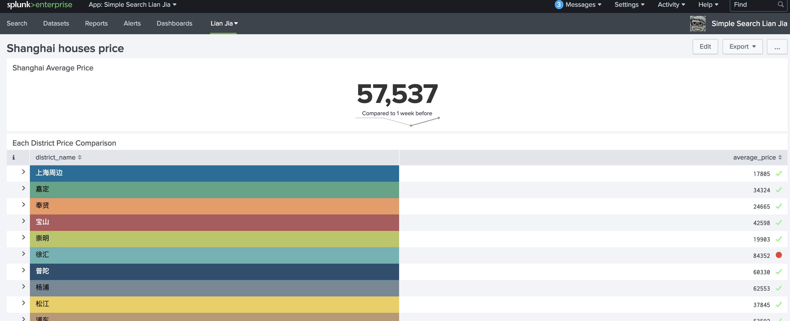
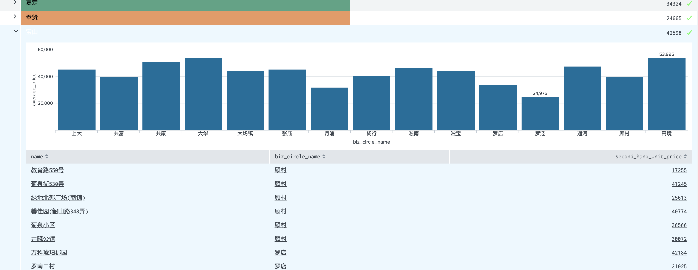
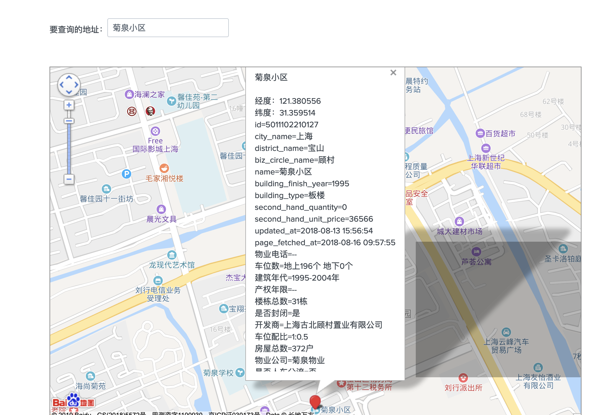

## Splunk Lian Jia

### It contains 2 parts:
- Fast_LianJia_Crawler (https://github.com/CaoZ/Fast-LianJia-Crawler), to fetch all data from Lian Jia (a Chinese houses searching website)
- Splunk App to monitor the data fetched by the script above and stored in local database 

### Sceen Shots:

